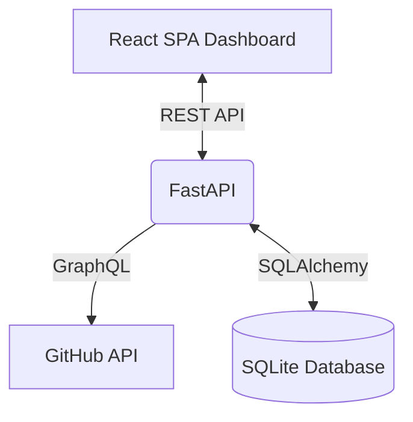

# Pull Request Intelligence Platform - Architecture & Implementation Document

## 1. Questions and Assumptions

**Questions Considered During Design:**
- *Metric Prioritization:* Which engineering metrics actually drive team performance? (Decided to focus on Time to Merge, PR Size, and active contribution counts to identify bottlenecks).
- *Data Refresh Rate:* Does the data need to be strictly real-time? (Determined that periodic or on-demand syncing is sufficient for MVP, rather than complex real-time WebSocket streams).
- *Scale:* Will a single user be tracking dozens of repositories, or just their immediate team's repos? (Designed the DB schema to handle multiple repositories cleanly).

**Assumptions Made:**
- **Source Control Provider:** GitHub is the primary and only source control system integrated for this MVP.
- **Authentication:** For the prototype phase, users are comfortable providing a GitHub Personal Access Token (PAT) directly to sync their repositories. 
- **Environment:** The evaluator will be running the backend locally or via a straightforward PaaS deployment, meaning a zero-configuration database (SQLite) is vastly preferable to requiring a local PostgreSQL Docker container.

---

## 2. Proposed Solution and Architecture

To optimize for both immediate developer velocity and future data-engineering scale, the platform utilizes a **decoupled architecture**.

**Tech Stack:**
- **Frontend (Client):** React + Vite. Styled with Tailwind CSS v4 for a premium, responsive UI. Charts are rendered using Recharts.
- **Backend (API):** Python + FastAPI. Chosen for its high performance, robust asynchronous support, and native integration with Python’s massive data science ecosystem.
- **Database:** SQLite managed via SQLAlchemy ORM.
- **Data Fetching:** GitHub GraphQL API.

**Architecture Flow:**

1. **The Client:** A Single Page Application (SPA) that provides a global view of all tracked repositories and drill-down dashboards for individual repos.
2. **The API Layer:** FastAPI exposes RESTful endpoints (`/api/sync`, `/api/repositories`). Pydantic models ensure strict request/response validation.
3. **The Sync Engine:** When triggered, the backend uses Python's `requests` library to query the GitHub GraphQL API. It fetches PR metadata, nested author objects, and comment counts in a single efficient network call, completely avoiding the N+1 problem common with GitHub's REST API.
4. **The Data Layer:** Parsed data is normalized and upserted into relational tables (`repositories`, `authors`, `pull_requests`).

---

## 3. MVP Scope

The MVP is scoped to a vertical slice that delivers immediate value by answering two core questions: *How long do PRs take to merge?* and *Who is driving the most throughput?*

**In-Scope Features:**
- **Repository Onboarding:** A form to sync any public or private GitHub repository using a PAT.
- **Data Aggregation:** Fetching the 100 most recently closed or merged PRs to build an immediate baseline of data.
- **Global Dashboard:** A high-level view of all synced repositories and their total PR counts.
- **Repository Intelligence Dashboard:**
  - **KPIs:** Total PRs, Merged PRs, Active Contributors, and Average Time to Merge (in hours).
  - **Visualizations:** A bar chart mapping individual engineers to their merged PR output.
  - **Leaderboards:** A table ranking the top 10 engineers by throughput and merge speed.
  - **PR Audit Log:** A detailed table of recent PRs highlighting code churn (Additions vs. Deletions).

**Out of Scope for MVP:**
- Multi-organization support, granular user authentication (OAuth), and automated webhook integrations.

---

## 4. Implementation Approach

The implementation was executed in four distinct phases to ensure stability at each layer:

1. **Data Modeling (Backend):** Designed normalized SQLAlchemy models to ensure data integrity between Repositories, Authors, and Pull Requests.
2. **Ingestion Engine (Backend):** Crafted the GraphQL query. GraphQL was chosen over REST specifically because calculating PR additions/deletions and comment counts via REST requires fetching every single PR individually, heavily throttling the API.
3. **API & Aggregation (Backend):** Built the FastAPI endpoints to not just serve raw data, but to calculate the average merge times and aggregate engineer metrics on the server side, keeping the frontend client lightweight.
4. **Visualization (Frontend):** Scaffolded the Vite application, implementing a modern, clean UI tailored for engineering managers to easily digest the metrics at a glance.

---

## 5. Key Tradeoffs and Scalability Considerations

**Tradeoff 1: Decoupled Stack vs. Monolith**
- *Decision:* Decoupled (React/Vite + FastAPI) instead of a monolithic full-stack framework like Next.js.
- *Reasoning & Scalability:* A "PR Intelligence Platform" inherently leans toward heavy data processing, analytics, and potentially future AI/ML workloads (e.g., predicting PR failure rates based on code churn). By establishing a Python backend from day one, we immediately unlock the Pandas/NumPy ecosystem and easily scale background tasks using Celery/Redis in the future.

**Tradeoff 2: SQLite vs. PostgreSQL**
- *Decision:* SQLite for the MVP.
- *Reasoning & Scalability:* SQLite requires zero external configuration, allowing evaluators or other developers to run the application instantly. However, SQLite struggles with high-concurrency writes. Because we used SQLAlchemy ORM, migrating to PostgreSQL for production scalability is trivial—requiring only a single line change to the database connection string.

**Tradeoff 3: On-Demand Polling vs. Webhooks**
- *Decision:* Manual/On-Demand sync via an API call from the frontend.
- *Reasoning & Scalability:* Implementing webhooks requires exposing a public endpoint, handling complex payload schemas, and managing failed delivery retries. For a prototype, on-demand syncing is significantly simpler to test. For a production release, migrating to GitHub App Webhooks is the very next step to ensure the dashboard reflects real-time data without users needing to manually trigger updates or manage PATs.
