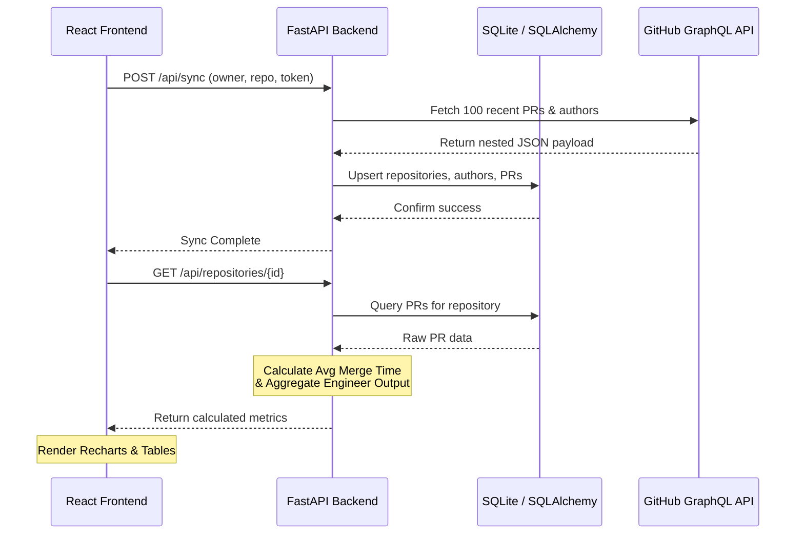

# Pull Request Intelligence Platform

Dashboard Preview
A decoupled, high-performance web application designed to collect pull request data from GitHub, calculate engineering quality metrics (like Average Time to Merge), and provide actionable insights via a modern React dashboard.

**GitHub Repository:** [Kushalsheth7/pr_intelligence](https://github.com/Kushalsheth7/pr_intelligence)  
**Submission Document:** [Assessment_Submission_Document.md](./Assessment_Submission_Document.md)

---

## 🏗️ Architecture & Tech Stack

To optimize for both immediate UI responsiveness and future big-data engineering/ML scale, this MVP utilizes a heavily decoupled architecture:

- **Frontend:** React + Vite, styled with Tailwind CSS v4, visualizing data via Recharts.
- **Backend:** Python + FastAPI for asynchronous, highly-typed REST endpoints.
- **Database:** SQLite managed via SQLAlchemy ORM (designed for easy migration to PostgreSQL).
- **Data Ingestion:** GitHub GraphQL API, fetching nested PR data, authors, and comments in a single optimized network request to prevent rate-limiting.

### Architecture Diagram


---

## 🚀 Quick Start (Local Development)

Because the project is decoupled, you will need two terminal windows to run it locally.

### 1. Start the Backend (FastAPI)
The backend uses a local SQLite database that will automatically generate upon startup.

```bash
cd backend

# Create and activate a virtual environment
python -m venv venv
# On Windows: .\venv\Scripts\activate
# On Mac/Linux: source venv/bin/activate

# Install dependencies
pip install -r requirements.txt

# Run the FastAPI server
uvicorn main:app --reload
```
The API will run on `http://localhost:8000`.

### 2. Start the Frontend (React + Vite)
```bash
cd frontend

# Install dependencies
npm install

# Run the development server
npm run dev
```
The React SPA will run on `http://localhost:5173`.

---

## 📊 How to Use the Dashboard

1. Open `http://localhost:5173` in your browser.
2. In the "Track New Repository" form, enter a GitHub Owner and Repository name (e.g., `facebook` and `react`).
3. Provide a standard **GitHub Personal Access Token (PAT)**. 
   *(Note: The PAT requires standard `repo` read scopes).*
4. Click **Add Repo**. The backend will immediately fetch the last 100 closed/merged PRs via GraphQL and securely upsert them into the SQLite database.
5. Click on the repository card to drill down into the metrics:
   - **KPIs:** Track average merge times and contributor counts.
   - **Engineer Output:** View a bar chart and leaderboard ranking developers by their throughput (Merged PRs).
   - **Audit Log:** Review recent PRs, code churn (additions/deletions), and merge status.

---
